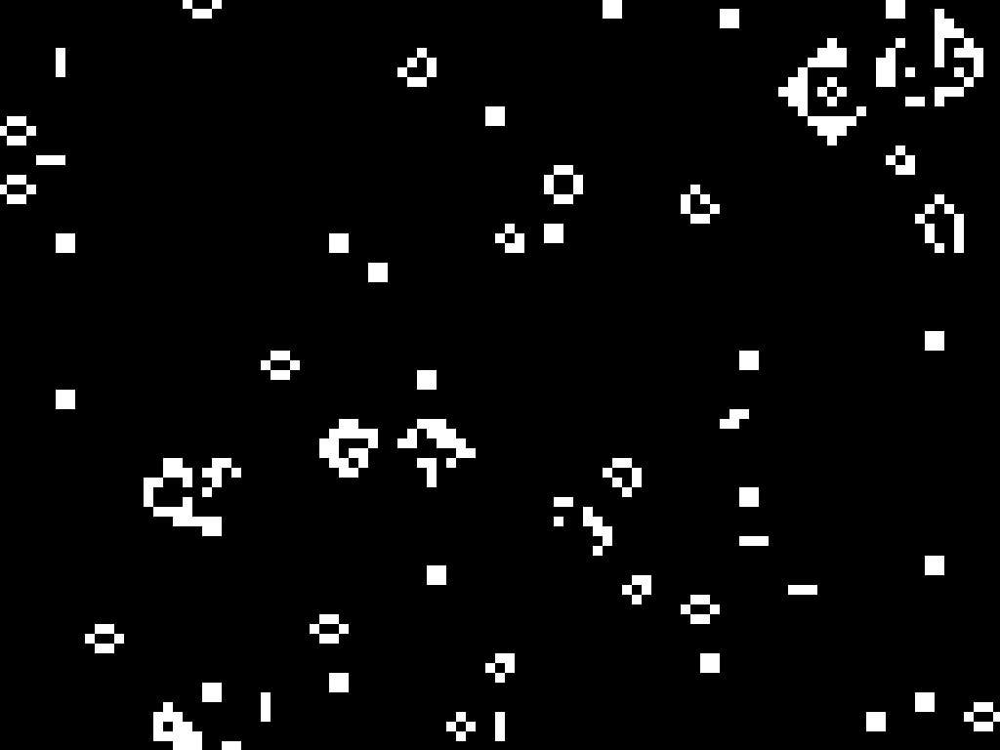

 

 gol 

 

Very simple and inefficient conway's game of life implementation in Rust, using the [nannou framework](https://github.com/nannou-org/nannou) for rendering.

This project was created as my first Rust project, to get a feel for the language. The universe contains $(2^{32})^2$ unique cells, and is donut shaped, such that structures - like gliders - emerge from the opposite side of the universe when reaching the end. 

The game keeps track of which cells are alive by storing the coordinates of live cells in a hash set. When cells are given life or killed, their coordinates are simply inserted into or removed from the hash set.

When compiling, I recommend that you use `cargo run --release`, as the performance enhancements in release mode makes the program much nicer to use. 

Here are some ways to interact with the game:

| Input                    | Action                       |
| :------------------      | :--------------------------- |
| `left-click`             | Move view in mouse direction |
| `+` `-` (or scrollwheel) | Zooms in or out              |
| `tab`                    | Toggles stats                |
| `c`                      | Toggle dark mode             |
| `h`                      | Jump back home, to (0, 0)    |
| `j`                      | Jump to random live cell     |
